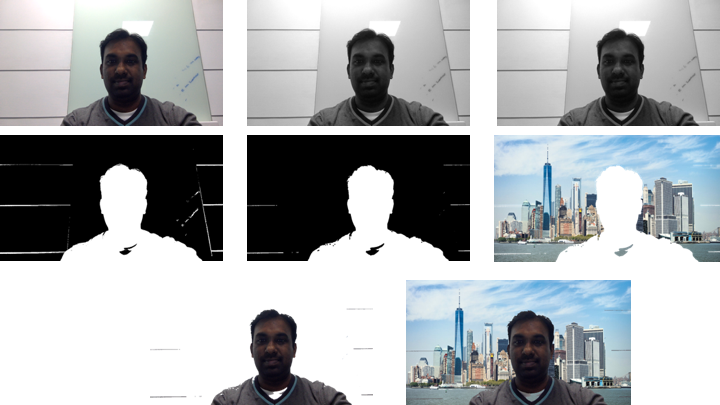
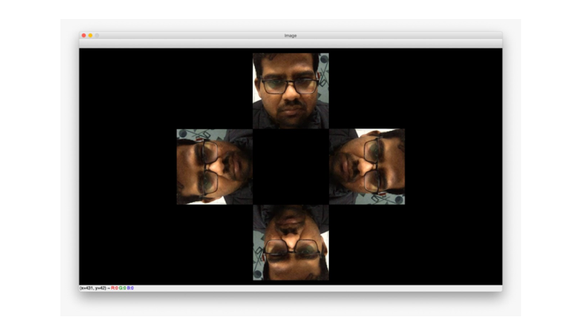
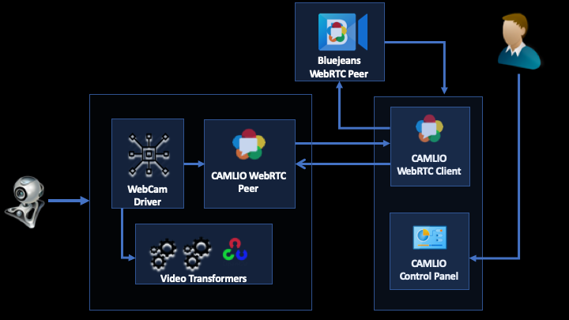

# Camlio

Experiments with real-time video processing https://camlio.live. This was a hack built at [Arcesium](https://arcesium.com) Hackathon 2019 in 24 hrs. Camlio is a Bluejeans client that uses real-time video processing techniques to enhance 'work from home' experience.

## How to try this out? 

- You need to start the core engine using the instructions [here](core/README.md)
- BlueJeans API / SDK doesn't support CORS. Hence, web client needs to be accessed by disabling web security.
- Open Chrome by disabling web security ([Instructions](web-client/README.md)). Go to https://camlio.live to start your Bluejeans session
- To try out the hologram projection, build a DIY hologram projector using instructions [here](https://www.instructables.com/id/DIY-3D-Hologram-Projector-Simple-and-Easy/). Start a BlueJeans session. Then, select the hologram option in the Camlio controls. Connect to the same session from your mobile / tablet. Use the hologram pyramid on your device to view the hologram.

## Features Provided
- Professional immersive experience with hologram projection
- Replace background without green screen technique
- Multi-user Desktop share
- Platform Neutral

### Background replacement

### Hologram Projection

## Architecture

## Technologies used

- Used
   - Web RTC
   - Bluejeans SDK
   - Python 3.7 & Open CV
   - Vanilla web technologies
   - Netlify

- Explored
   - Unet Human segmentation
   - Keras
   - Tensorflow
   - Syphon
   - PyUSB
   - Windows DirectShow

## Contributors

[@sreekanthnaga](https://twitter.com/sreekanthnaga)
[@varunkumar](https://twitter.com/varunkumar)
